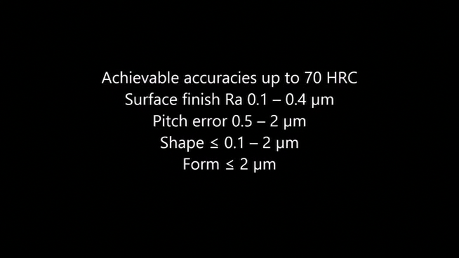

- ## 名词
	- ### 87186409a104a5fa6efa86fe0bc49427-张潇.mp4
		- a ball screw nut 滚珠丝杠螺母
		- Measuring raceway profile 测量滚道轮廓
		- Machining of I.D 内径加工
		- Pitch error 螺距误差
		- HRC是精度的单位吗？shape和form的区别是是什么？
		- 
	- ### 滚动直线导轨副
		- 由由导轨、滑块、滚动体、返向器等组成
		- **精度** 滑块与导轨基准面之间的平行度误差
			- id:: 6434ca62-98c8-4d86-8158-10f1dd21f484
			  |普通级|无标注|
			  |高级（H）|3μm|
			  |精密级（P）|2μm|
			  |超精密级（SP）|1.5μm|
			  |超超精密级（UP）|1μm|
			-
			-