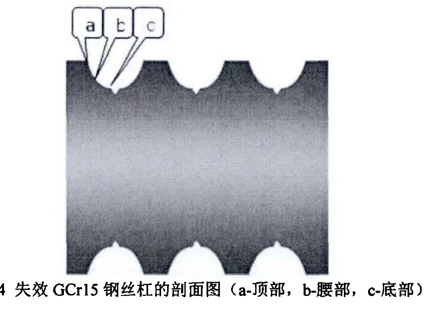

- ## 失效分析方法
	- ### 化学成分分析法
		- 整体或局部的成分是否符合设计要求
		- 微分成分分析，失效源区是否有异常材料夹杂、腐蚀产物、新的化合物生成
	- ### 表面形貌
		- 是否有点蚀、微裂纹
	- ### 金相分析法
		- 相的形态、数量、粗细、分布及均匀性，是否有冶金及加工缺陷（缩孔、疏松、夹杂物）
	- ### 残余应力分析法
	- ### 硬度梯度分布检测
		- 理想状态是滚道底部淬硬层深可达1-1.5mm，淬硬层维氏硬度在700HV，过渡区硬度梯度分布小，心部硬度在300HV
		- 